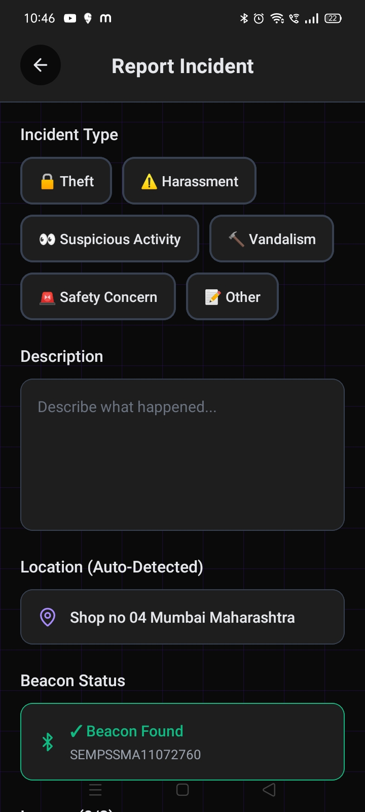
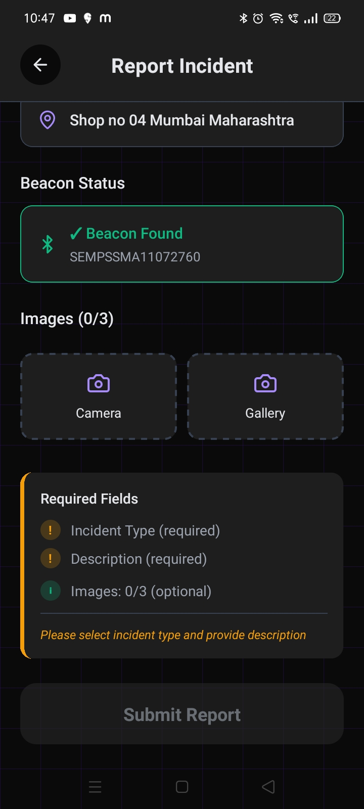
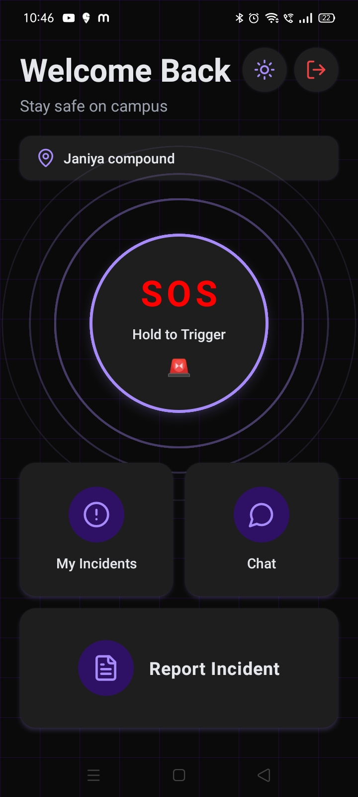
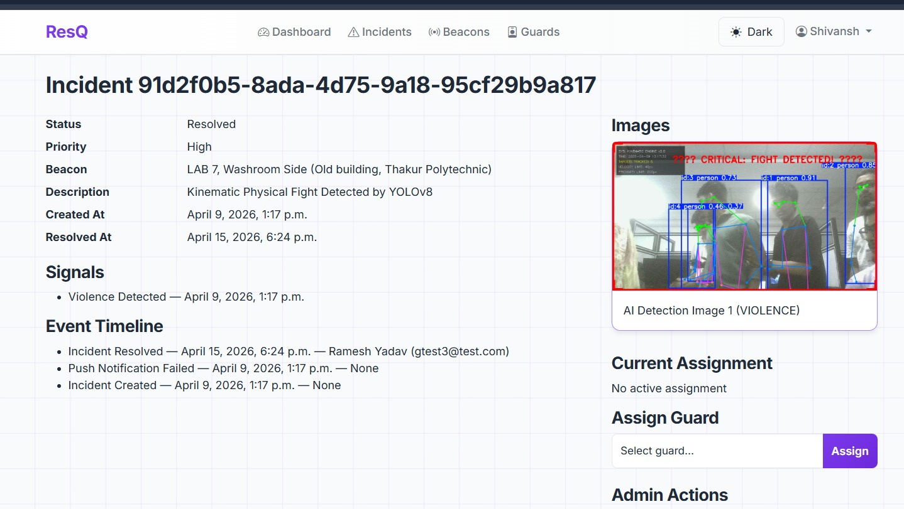
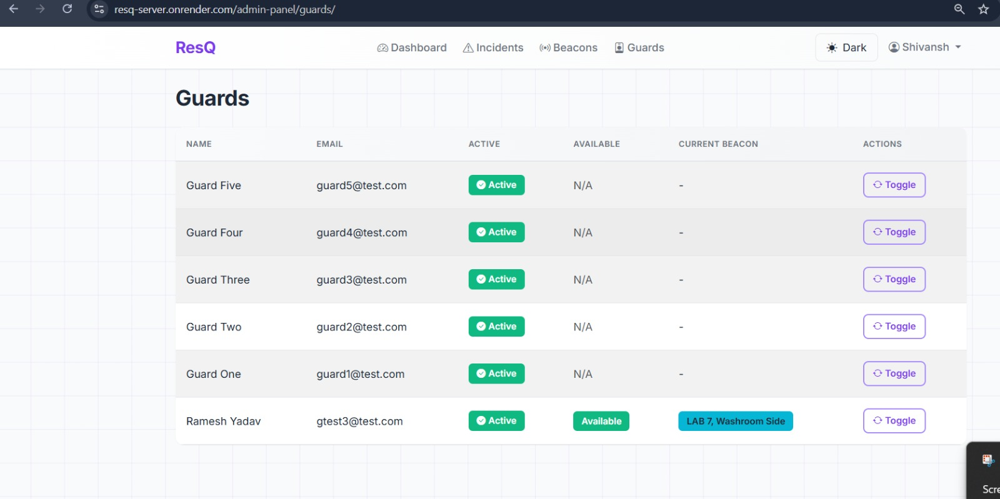
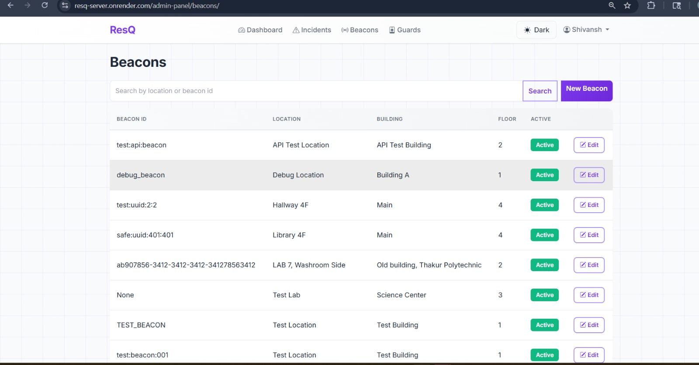
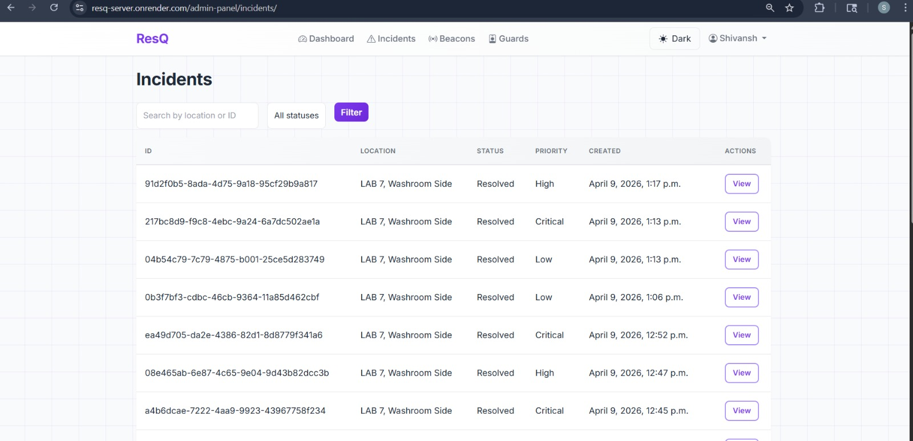
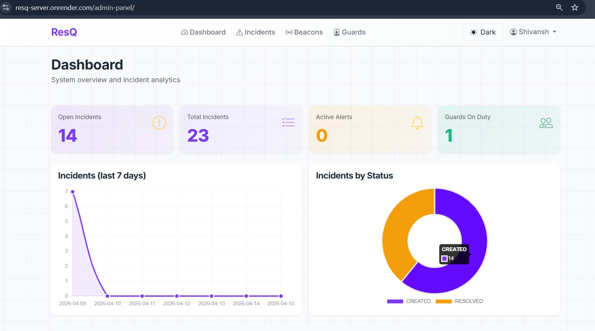
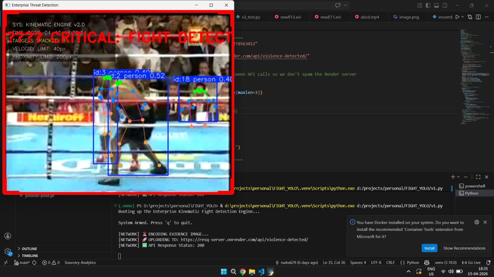
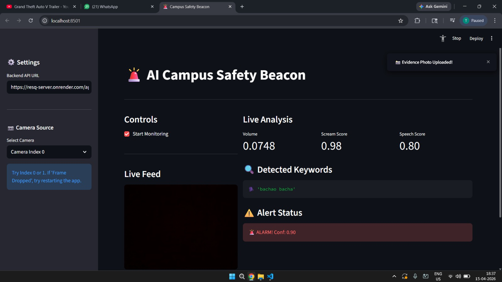

<div align="center">

# 🚨 RESQ — Safety in Seconds

**A proactive, automated campus safety ecosystem that replaces slow, reactive manual security.**  
RESQ combines mobile SOS triggers, offline IoT hardware fallbacks, and autonomous AI threat detection  
to instantly locate and dispatch help during an emergency — *even without an active internet connection.*

[](https://www.djangoproject.com/)
[](https://reactnative.dev/)
[](https://www.espressif.com/)
[](https://www.tensorflow.org/)
[](https://developer.mozilla.org/en-US/docs/Web/API/WebSockets_API)

</div>

---

## 📸 App Preview

<table>
  <tr>
    <td width="33%"></td>
    <td width="33%"></td>
    <td width="33%"></td>
  </tr>
  <tr>
    <td width="33%"></td>
    <td width="33%"></td>
    <td width="33%"></td>
  </tr>
  <tr>
    <td width="50%"></td>
    <td width="50%"></td>
  </tr>
  <tr>
    <td width="50%"></td>
    <td width="50%"></td>
  </tr>
</table>

---

## 🧠 The Core Concept

> *"What if every second after an emergency is already covered — automatically?"*

RESQ is built on a single principle: **human reporting is too slow**. By the time a bystander notices an incident, pulls out their phone, dials security, and explains the location — critical seconds are lost. RESQ eliminates every one of those steps through three parallel pillars:

| Pillar | What it does |
|---|---|
| 📱 **Mobile SOS** | One-tap panic button on the student's app sends a geo-tagged alert instantly |
| 📡 **Offline IoT Mesh** | If there's no internet, BLE + ESP32 gateways relay the alert through the campus network |
| 🤖 **Autonomous AI** | CCTV + microphone feeds are monitored 24/7 — no human trigger required |

---

## ⚙️ Tech Stack

### 📱 Frontend / Mobile
- **React Native + Expo** — Cross-platform iOS & Android guard + student apps

### 🖥️ Backend
- **Django + Django REST Framework** — Core API layer
- **Django Channels + WebSockets** — Real-time incident push to guard devices
- **PostgreSQL** (production) / **SQLite** (dev) — Data persistence

### 📡 IoT / Hardware
- **ESP32 Microcontrollers** — BLE gateway nodes + panic button hardware
- **Bluetooth Low Energy (BLE) Beacons** — Indoor precision location tracking
- **Condenser Microphones** — Audio threat detection (scream/distress detection)
- **C/C++ (Arduino / ESP-IDF)** — Firmware for all hardware nodes

### 🤖 AI / ML
- **Python + TensorFlow / PyTorch** — Model training and inference pipeline
- **CNN + LSTM architectures** — Video violence detection from CCTV feeds
- **Audio classification models** — Distress scream detection from mic arrays

---

## ✨ Key Features

### 🔌 Offline IoT Gateway
The biggest differentiator. When a student has **no internet**, the SOS signal is routed via **Bluetooth through a mesh of ESP32 gateways** until it reaches a node with connectivity and hits the server. Physical panic buttons on walls act as an additional hardware failover — no app, no phone needed.

### 📍 Precision Indoor Tracking
GPS fails inside buildings. RESQ uses **BLE beacon triangulation** to pinpoint exactly which floor, wing, and corridor an alert came from — removing all location ambiguity from the dispatch message.

### 🎯 Autonomous AI Detection
Doesn't wait for humans to report. **Deep learning models** analyze live CCTV feeds for violence/fights in real-time. Simultaneously, **ESP32 microphone arrays** listen for high-frequency distress screams — both trigger fully automated alerts with zero human intervention.

### 🧩 Smart Incident Aggregation
When 5 students panic simultaneously during one incident, the Django backend **intelligently groups** all those alerts into a single unified Incident, preventing the security dashboard from being flooded and ensuring guards respond to one clear, consolidated report.

### 📲 Multi-Channel Dispatch
Alerts are pushed to guards via **WebSockets in real-time** (< 1 second). If the WebSocket connection drops, an automated **WhatsApp bot message** acts as a secondary failover — ensuring the message always gets through.

---

## 🔄 Operational Workflow

```
┌─────────────────────────────────────────────────────────────────┐
│                         EMERGENCY OCCURS                        │
└──────────────────────────┬──────────────────────────────────────┘
                           │
          ┌────────────────┴─────────────────┐
          ▼                                  ▼
   MANUAL TRIGGER                    AUTO DETECTION
  (App SOS / Panic Button)     (AI Video / Mic Audio)
          │                                  │
          └────────────────┬─────────────────┘
                           ▼
                   SIGNAL TRANSMISSION
           ┌───────────────┴──────────────────┐
           ▼                                  ▼
   Online → Wi-Fi/4G              Offline → BLE Mesh Hop
   (Direct to server)          (ESP32 → ESP32 → Server)
           │                                  │
           └───────────────┬──────────────────┘
                           ▼
                  DJANGO BACKEND PROCESSING
            • BLE coordinate → indoor location
            • Duplicate alert aggregation
            • Incident object created
                           │
                           ▼
                      DISPATCH
           ┌───────────────┴──────────────────┐
           ▼                                  ▼
   Guard Mobile App                  Admin Dashboard
  (WebSocket push)               (Real-time incident feed)
           │
           ▼
   WhatsApp Bot Failover
  (if WebSocket drops)
```

---

## 🗂️ Project Structure

```
resq_backend/
├── accounts/          # Auth, user roles (student/guard/admin)
├── incidents/         # Incident model, aggregation logic, API
├── security/          # Guard profiles, patrol management
├── ai_engine/         # AI model integration, CCTV stream handlers
├── chat/              # WebSocket consumers, real-time channels
├── adminEnd/          # Admin dashboard APIs
├── campus_security/   # Django project settings & root URLs
├── credentials/       # Service account keys (GCS, etc.)
├── docs/screenshots/  # App screenshots
├── ESP32_BUZZER_CODE.ino  # Firmware for ESP32 panic button
├── manage.py
├── requirements.txt
├── Procfile           # Render/Heroku deployment
└── test.http          # Full API test suite (REST Client)
```

---

## 🚀 Getting Started

### Prerequisites
- Python 3.10+
- pip
- (Optional) Google Cloud Storage credentials for production media

### Installation

```bash
# Clone the repo
git clone https://github.com/your-org/resq_backend.git
cd resq_backend

# Create virtual environment
python -m venv venv
venv\Scripts\activate        # Windows
# source venv/bin/activate   # macOS/Linux

# Install dependencies
pip install -r requirements.txt

# Configure environment
cp .env.example .env
# Edit .env with your DB, secret key, GCS credentials

# Run migrations
python manage.py migrate

# Start server
python manage.py runserver
```

### Testing the API
Open `test.http` in VS Code with the **REST Client** extension to run the full API test suite — auth, incidents, guards, BLE beacons, AI endpoints, and more.

---

## 🌐 Deployment

The backend is configured for **Render** deployment:
- `Procfile` — defines the web process (`gunicorn`)
- `render.yaml` — service configuration
- `SYSTEM_ARCHITECTURE.md` — full system design reference

---

<div align="center">

**Built with ❤️ for campus safety**  
*Every second counts. RESQ makes sure help is already on the way.*

</div>
